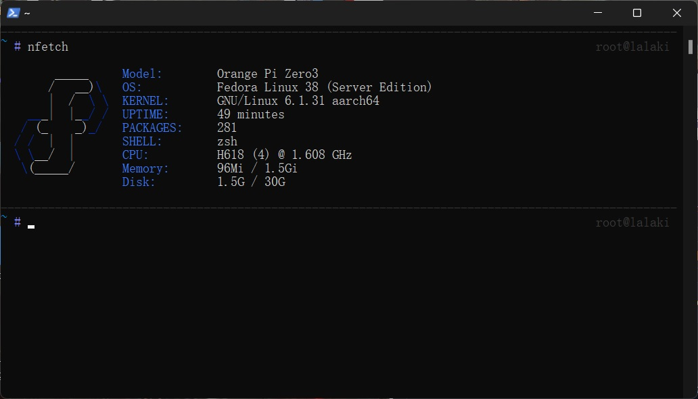

# OrangePi_Zero3_Fedora_img【Preview】

## Quick Start

**Fedora 28 for Orange Pi Zero3 (default 1.5GB uboot): [Download](https://drive.google.com/file/d/104cjaPTqkKlZUNhH5R7KwzsoHPgyc8NV/view?usp=sharing)**

+ User: root (no password)
+ SSID: opi-zero3
+ Gateway: 192.168.10.254

## Uboot update

**Uboot download, see: https://github.com/leeboby/opizero3-uboot-dtb**

**[ImagePatcher.exe](https://github.com/lalakii/orangepi_zero3_fedora_img/blob/master/ImagePatcher.exe), use this tool to update the uboot of the image.**

## Systeminfo

